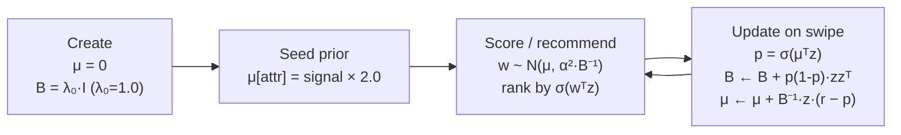
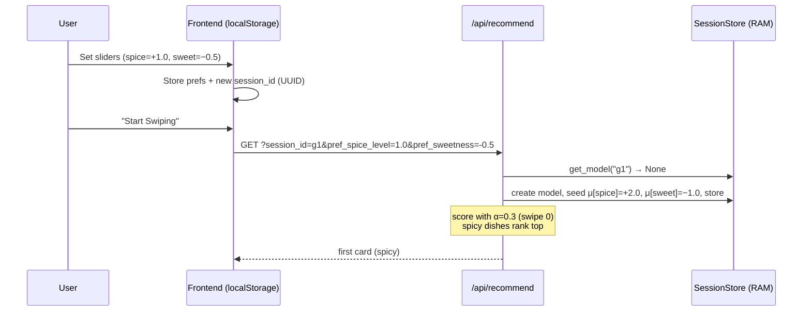
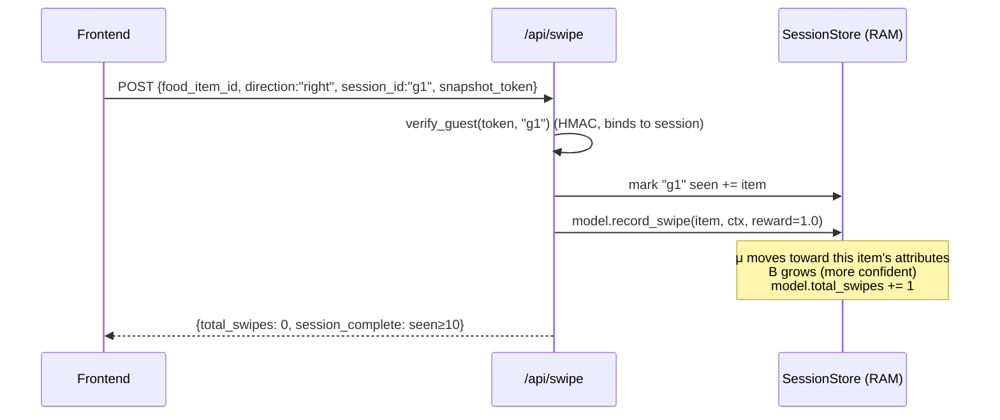
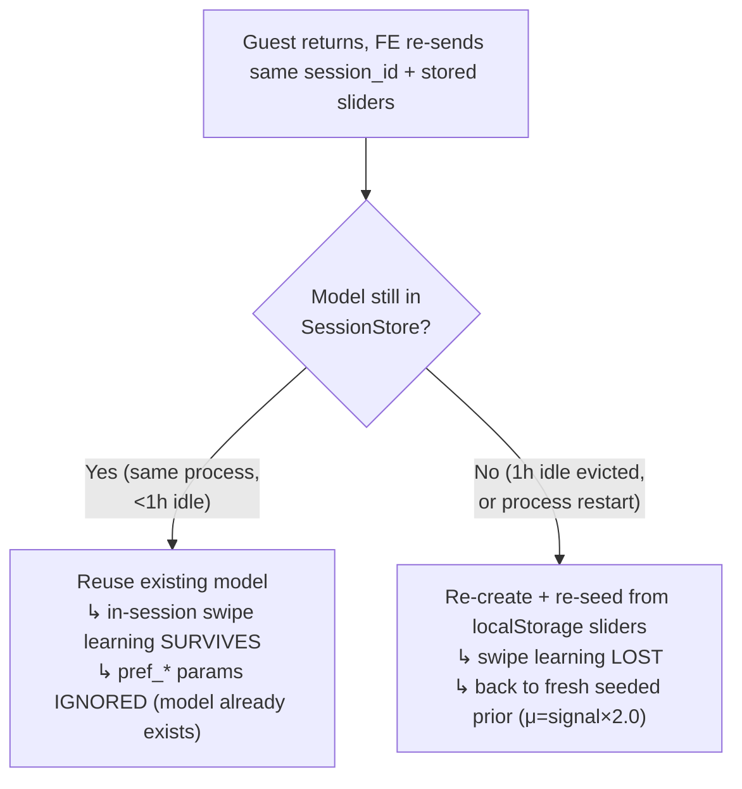
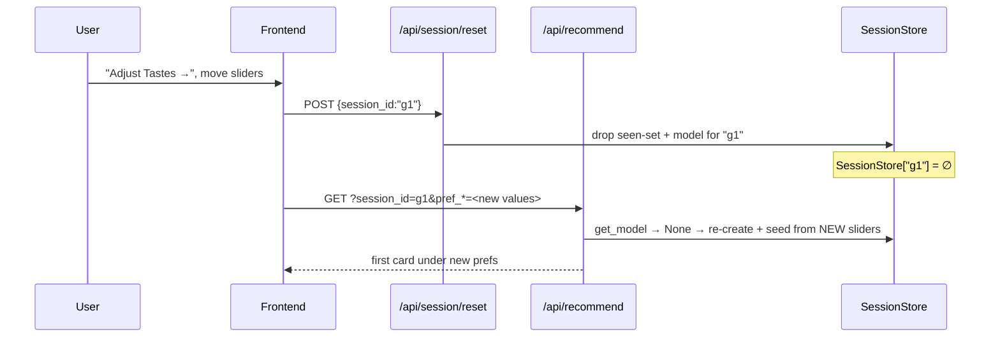
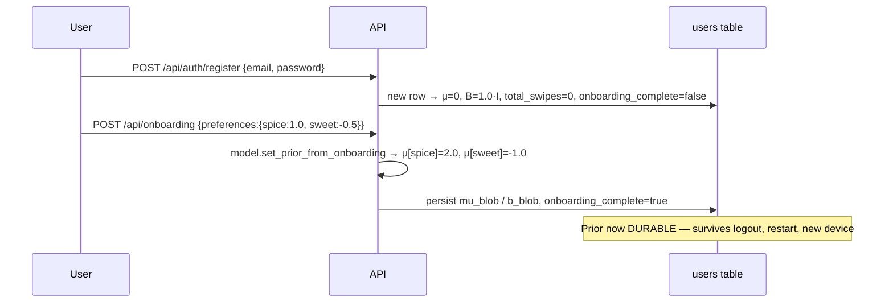
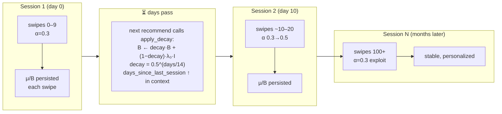
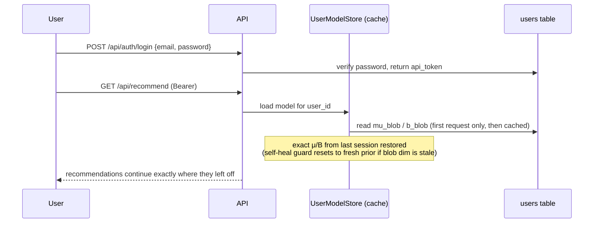
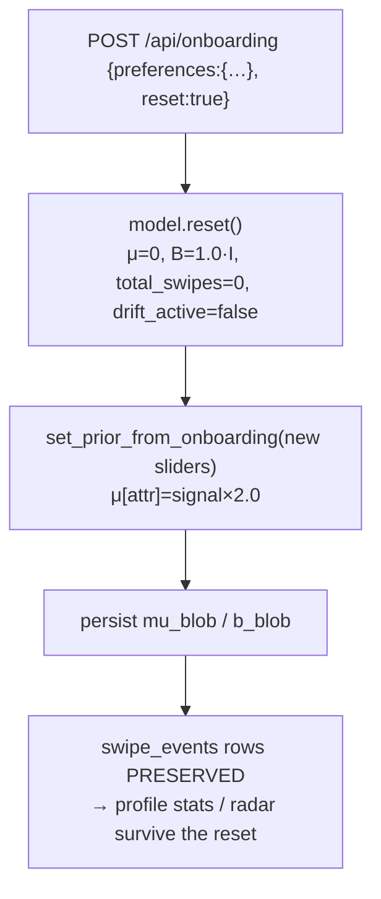

# Model Lifecycle Scenarios — How the Thompson Model Updates

A visual walkthrough of **what happens to the model** in every real-world scenario: a
guest on cold start, a guest revisiting, a guest resetting tastes, and a registered user
logging back in, setting preferences, and swiping across multiple sessions.

> **Companion docs:** [`CLAUDE.md` → Per-User Model Lifecycle](./CLAUDE.md) (mechanics),
> [`PROJECT.md` §3](./PROJECT.md) (spec), [ADR-0008](./adr/0008-onboarding-cold-start-retune.md)
> (cold-start tuning), [ADR-0005](./adr/0005-stateless-guest-no-db-row.md) (stateless guest).

---

## 0. The two identities at a glance

The single most important distinction: **where the model lives and how long it survives.**

```
        GUEST                                    REGISTERED
  ┌───────────────────────┐              ┌───────────────────────────┐
  │  ThompsonSamplingModel │              │  ThompsonSamplingModel     │
  │  in SessionStore (RAM) │              │  μ_blob / b_blob in users  │
  │  keyed by session_id   │              │  table (SQLite), by user_id│
  └───────────────────────┘              └───────────────────────────┘
   • seeded from localStorage              • seeded once via /api/onboarding
     sliders on each request                 (persisted to DB)
   • swipe updates kept in RAM only         • every swipe update persisted to DB
   • NO swipe_events rows                   • swipe_events row per swipe
   • NO temporal decay                      • temporal decay between sessions
   • dies on: reset / 1h idle / restart     • survives forever (until delete)
   • lives entirely in α=0.3 phase          • walks the full α schedule 0.3→0.5→0.3
     (sessions are ≤10 swipes)
```

| Property | **Guest** | **Registered** |
|---|---|---|
| Model storage | In-memory `SessionStore`, key = `session_id` | DB BLOBs `mu_blob`/`b_blob`, key = `user_id` |
| Seeded from | `pref_*` query params (localStorage sliders) | `POST /api/onboarding` body (persisted) |
| Swipe history | **Never persisted** (`swipe_events` untouched) | One `swipe_events` row per swipe |
| Cross-session memory | Only while model stays in RAM (<1h idle, no restart) | Always |
| Temporal decay | No | Yes (`apply_decay`, ≥6h gate, on every recommend) |
| `total_swipes` in API response | Always `0` | Real lifetime count |
| Reset mechanism | `POST /api/session/reset` (drops RAM model) | `POST /api/onboarding {reset:true}` (wipes BLOB) |

---

## 1. The shared model math (used by both identities)

Every scenario below is some combination of these four operations.



| Operation | When | Effect |
|---|---|---|
| **Create** | New guest session model / `register` | Blank slate: `μ=0`, `B=λ₀·I`, `λ₀=1.0` |
| **Seed prior** | Onboarding sliders | `μ[attr] = signal × 2.0` (signal ∈ [−1,1]); `B` untouched |
| **Score** | `GET /api/recommend` | Sample `w`, rank candidates by `σ(wᵀz)`; `α` from swipe count |
| **Update** | `POST /api/swipe` | Move `μ` toward reward `r` (right=1.0, left=0.3); grow `B` (confidence) |

**Exploration α (drives how much `Score` trusts `μ` vs explores):**

```
 swipe #:   0 ─────────────── 19 │ 20 ──────────── 99 │ 100+
 α:               0.3            │       0.5          │  0.3
 phase:    trust onboarding prior│  explore to refine │  exploit
            (low variance)       │                    │
 (drift:  recent_rejection_rate ≥ 0.6  →  α = 0.8, re-explore)
```

> **Why the U-shape?** Retuned Jun 2026 (ADR-0008). Card 1 must reflect the sliders, so
> early α is *low* (0.3) — high α would let sampling noise drown a freshly-seeded prior.

> **Sticky-prior caveat:** `B` grows on every swipe, so `B⁻¹` shrinks and each `μ` update
> gets smaller. After ~3 consistent contradicting swipes, `μ` plateaus. This is why
> `prior_strength` is capped at 2.0 — a stronger prior would *trap* a mis-set slider.

---

## 2. GUEST — Cold start (first visit)



**State after cold start:**

```
 SessionStore["g1"] = ThompsonSamplingModel(
     μ = [ +2.0 (spice), −1.0 (sweet), 0, 0, … ],   ← seeded
     B = 1.0·I,                                       ← untouched
     total_swipes = 0  →  α = 0.3
 )
 DB: nothing written.
```

✅ **Result:** first card honors the sliders (ADR-0008 took the spicy-guest "mild card"
rate from ~50% to ~3% on the real catalog).

---

## 3. GUEST — Swiping within the session

Each swipe updates the **in-RAM** model only. No DB writes.



```
 swipe 1 (right on a spicy dish):  μ[spice] 2.0 → ~2.05,  B grows
 swipe 2 (left  on a sweet dish):  μ[sweet] −1.0 → ~−1.1,  B grows
 …
 API always reports total_swipes = 0  (guests have no lifetime count)
 Internally model.total_swipes climbs 1,2,3… but a session is ≤10 swipes,
 so the guest model stays in the α=0.3 band the entire time.
```

> Guest sessions are short (≤ `CRAVINGS_SESSION_MAX_SWIPES`, default 10), so a guest
> **never leaves the "trust the prior" exploration phase**. In-session learning nudges
> the seeded prior but doesn't override it.

---

## 4. GUEST — Revisiting

What happens on return depends entirely on **whether the RAM model still exists.**



| Situation | Model state on return |
|---|---|
| Same process, < 1h idle | **Reused** — accumulated swipe updates intact. `_ensure_model` finds it and returns it; the re-sent `pref_*` are *not* re-applied. |
| 1h idle (TTL evicted) or server restart | **Re-seeded fresh** from the sliders in localStorage. All in-session swipe learning is gone — guests have no persisted history to rebuild from. |

> **Key point:** a guest's swipe learning is *opportunistically* preserved (cheap RAM
> cache) but never *guaranteed*. The durable part of a guest's identity is the **slider
> values in localStorage**, which deterministically reproduce the seeded prior.

---

## 5. GUEST — Resetting tastes ("Adjust Tastes →")

To change sliders mid-life, the guest must drop the old model first — otherwise
`_ensure_model` would keep reusing the stale one (§4).



```
 Before reset:  SessionStore["g1"] = model(μ shaped by old sliders + swipes)
 reset():       SessionStore["g1"] = ∅           (seen-set + model dropped)
 Next recommend: fresh model seeded from NEW slider values, total_swipes=0, α=0.3
```

✅ Equivalent to a clean cold start (§2) with the new slider values.

---

## 6. GUEST — Skipped onboarding (no prefs)

```
 GET /api/recommend?session_id=g1     (no pref_* params)
      │
      ▼
 _ensure_model():  taste_prefs == {}  →  returns None
      │
      ▼
 Global Popularity fallback:  rank by aggregate right-swipe rate, score = 0.0
      │
      ▼
 No model created, no learning, no DB writes.
```

> Swipes by a no-prefs guest still mark the seen-set (no repeats) but train nothing.

---

## 7. REGISTERED — Account creation & setting preferences



```
 Phase 1 (register):   μ = 0,                 B = 1.0·I      [persisted]
 Phase 2 (onboarding): μ = [2.0, −1.0, 0, …], B = 1.0·I      [persisted]
```

The only structural difference from the guest seed (§2) is the **last step: it's written
to the DB.** Same math, same `prior_strength = 2.0`, same `λ₀ = 1.0`.

---

## 8. REGISTERED — A single recommend → swipe cycle

```mermaid
sequenceDiagram
    participant FE as Frontend
    participant REC as /api/recommend
    participant MS as ModelServer
    participant DB as DB

    FE->>REC: GET (Bearer token)
    REC->>MS: apply_decay(user_id)   (≥6h gate; persists only if it ran)
    REC->>DB: get_swiped_cuisines (stratified cold-start)
    REC->>MS: recommend → sample w~N(μ,α²B⁻¹), score σ(wᵀz), +embedding boost
    REC-->>FE: top card + HMAC snapshot_token

    FE->>REC: POST /api/swipe {direction, snapshot_token}
    REC->>MS: verify token → record_swipe(reward)
    Note over MS: p=σ(μᵀz); B←B+p(1-p)zzᵀ; μ←μ+B⁻¹z(r-p)
    MS->>DB: persist updated mu_blob / b_blob
    REC->>DB: INSERT swipe_events (denormalized context)
    REC-->>FE: {total_swipes: N, session_complete: N≥10}
```

Unlike a guest, **every swipe persists**: updated `μ/B` to `users`, plus a `swipe_events`
row capturing the exact context at swipe time.

---

## 9. REGISTERED — Multiple sessions over time

This is where the registered model genuinely diverges from a guest: **decay + a growing
swipe count walk the model through the full α schedule.**



What changes between and across sessions:

| Mechanism | Effect across sessions |
|---|---|
| **Persisted `total_swipes`** | Climbs across sessions → α walks `0.3 → 0.5 (at 20) → 0.3 (at 100)`. The onboarding prior is gradually overwritten by real swipes. |
| **Temporal decay** | On the first recommend after ≥6h, `B` shrinks toward `λ₀·I` by `0.5^(days/14)` — old swipes lose weight (~14-day half-life). Lets taste drift. Persisted only when it runs. |
| **`days_since_last_session`** | A context feature in `z` — the model can encode "returning after a long gap" differently. |
| **Drift detection** | If the last-10 rejection rate ≥ 0.6, `α` jumps to 0.8 (`drift_active` persisted) → re-explores until it recovers. |

> **Guest contrast:** none of this applies to a guest. No persisted count (so always
> α=0.3), no decay (fresh model each session), no `days_since` history, no cross-session
> drift tracking.

---

## 10. REGISTERED — Logging back in



Login restores the **exact** posterior — the model picks up precisely where the last
session ended (after the usual decay catch-up on the first recommend). Contrast a guest,
whose "return" at best reuses a RAM cache and at worst re-seeds from sliders (§4).

> The self-heal guard (`UserModelStore._load_or_create`) resets a stale-dimension blob to
> a fresh prior instead of crashing — see [Model load paths](./CLAUDE.md) and ADR-0007.

---

## 11. REGISTERED — Taste reset ("Adjust Tastes →")

The registered analogue of §5, but it **wipes the persisted posterior** and reseeds.



```
 Before:  μ = (months of learned weights),  total_swipes = 240
 reset():  μ = 0,  B = 1.0·I,  total_swipes = 0,  drift_active = false
 reseed:  μ = signal × 2.0 from NEW sliders
 KEPT:    all swipe_events rows  →  lifetime count & profile charts unaffected
```

> `users.total_swipes` (the model's α counter) resets to 0 → back to α=0.3. But the
> profile's lifetime swipe count is `COUNT(*)` over `swipe_events`, which is **not**
> touched — so the visible history survives a taste reset (P21).

---

## 12. Master comparison — what survives what?

| Event | Guest model | Guest swipe history | Registered model | Registered swipe history |
|---|---|---|---|---|
| Swipe | updated (RAM) | — (never stored) | updated + persisted | `swipe_events` row added |
| Page revisit < 1h | reused | — | reloaded from DB | intact |
| 1h idle / server restart | **re-seeded from sliders** | — | reloaded from DB | intact |
| Session reset | **dropped → re-seed** | — | n/a | n/a |
| Taste reset | **dropped → re-seed** | — | **wiped → re-seed** | **preserved** |
| Logout / login | n/a (no account) | n/a | reloaded from DB | intact |
| Days pass (gap) | n/a (fresh each session) | n/a | **decayed** toward prior | intact |
| Account delete | n/a | n/a | row deleted (GDPR) | deleted (GDPR) |

---

## 13. One-line mental model

- **Guest** = a model *reconstructed from localStorage sliders* on demand; swipe learning
  is a short-lived RAM bonus. The sliders are the only durable identity.
- **Registered** = a model that *remembers everything* — seeded once, updated and persisted
  every swipe, decayed over time, restored exactly on login.

Both share the **same cold-start math** (`μ = signal × 2.0`, `λ₀ = 1.0`, `α = 0.3` on
card 1) so the very first recommendation honors the sliders identically (ADR-0008).
